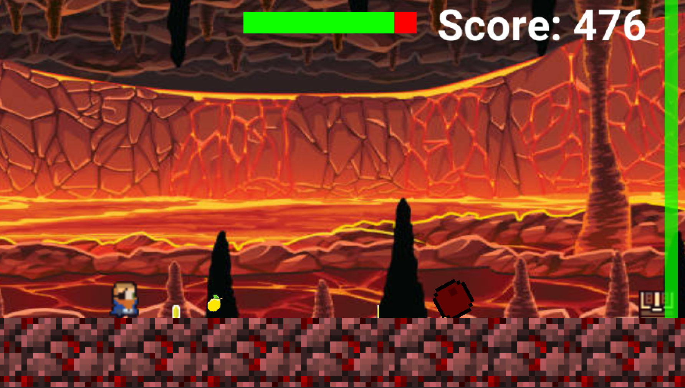
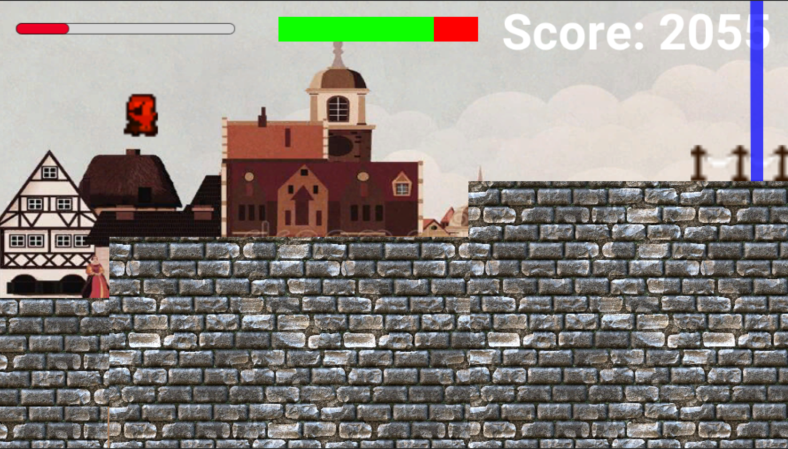

# OneButtonGame

## Dev-Diary
Dies ist das "Developer Diary" von Lars Gudjons, Tim Maier und Fabian Krauß für das One-Button-Game "**XYZ**", das im Rahmen des Serious Games Moduls an der TU Darmstadt im Sommersemester 2022 entwickelt wurde. <br>
Das fertige Spiel wurde auf Unity Play veröffentlicht und kann hier gespielt werden: https://play.unity.com/LINK-LINK-LINK

### Aufgabe 1
**31.05.22**

- Download von Unity und Erstellen eines 3D Projektes


**14.06.22**

- Erstellen einer Kamera und eines Zylinders, der den Player symbolisiert.
	- Kamera ist an die Player-Position geheftet und folgt ihm
- Player bewegt sich mit konstanter Geschwindigkeit nach rechts.
- verschiedene Piraten-Assets hinzugefügt
  - anfängliche Probleme beim Import, da mehrere Scenes den gleichen Namen hatten
- Collision Detector für Player und ein Fass als erstes Hindernis
- Player kann springen
  - verschiedene Konfigurationen für Masse und Schwerkraft ausprobiert
- Erstellen von Hauptmenü und Endscreen
  - vom Hauptmenü gelangt man in die MainPirateScene (das Spiel) und bei einer Kollision mit einem Hindernis kommt man automatisch in den Endscreen.
- Hinzufügen eines Scores, der pro Frame inkrementiert wird
  - der Score wird im Spiel in einem Textfeld angezeigt, das der Bewegung des Players folgt.

<p align="center">
   
</p>

Mit diesen Ergebnissen wurde Aufgabe 1 erfolgreich abgeschlossen! :)

### Aufgabe 2
**15.06.22**

Nach mehreren Problemen mit der Ausrichtung von Objekten in Relation zur Kamera haben wir uns entschlossen, ein neues Projekt in 2D zu erstellen und die bisherigen Ergebnisse auf das neue Projekt zu übertragen.
Ein weiterer Vorteil hiervon ist, dass wir nun das bereitgestellte Asset-Set nutzen können.


<p align="center">
   
</p>

**21.06.22**

- Erzeugung von Collectables in Form von Coins, die beim Einsammeln den Score um 100 erhöhen.
- Implementierung einer "CoinFactory", die in zufälligen Zeitabständen neue Coins erstellt, die kurz hinter dem Bildrand spawnen.
- Erzeugung von Skeletten als bewegliche Hindernisse/Gegner
  - die Skelette wechseln in zufälligen Zeitabständen die Bewegungsrichtung und kollidieren nicht mit Kisten. Diese Zeitabstände können im Scene Tab angepasst und somit zwischen verschiedenen Leveln geändert werden. 
- Anwendung des Factory-Prinzips auf Kisten und Skelette, sodass auch diese nun zufällig erstellt werden.
  - für jeden Objekttyp wurde ein eigenes Factory-Skript erstellt und die relevanten Variablen so deklariert, dass sie bequem aus der Unity-GUI geändert werden können.
- Hinzufügen eines DEBUG-Modus, in dem man nicht mit Hindernissen kollidiert (vereinfacht das Testen des Spiels).

### Aufgabe 2 & 3
**22.06.2022**

- Münzen drehen sich jetzt um die z-Achse.
- die Kamera bewegt sich nun nur noch in x-Richtung mit dem Spieler mit, sodass sie in y-Richtung statisch bleibt (Kamera springt nicht mit, wenn der Spieler springt).
- neue Assets für Fässer und Boxen/Kisten als zusätzliche Hindernisse mit eigens ausgeschnittenem Sprite.
- rollende Fässer hinzugefügt und ebenfalls mit einem Factory-Skript versehen, sodass sie zufällig generiert werden können.
  - die Fässer rollen auf den Spieler zu und überrollen dabei auch alle Skelette, die ihnen in den Weg kommen (allerdings kein Einfluss auf Kisten)
- Hinzufügen einer Kanone mit Ladebalken, welcher in der linken oberen Ecke platziert ist. Dieser füllt sich, wenn der Spieler in der Nähe der Kanone ist und die Leertaste 0.5 Sekunden lang gedrückt hält. Der Ladebalken besteht aus einem modifizierten Slider GameObject. 
  - ist der Ladebalken voll und wird die Leertaste losgelassen, schießt eine Kanonenkugel auf das unüberwindbare Hinderniss, welches hinter der Kanone platziert ist
    - lässt der Spieler die Leertaste nicht los, wird die Kugel spätestens dann abgefeuert, wenn der Spieler auf Höhe der Kanone ist.
  - die Kugel fällt aufgrund der Gravitation auf den Boden, wo sie dann zerstört wird. Somit ergibt sich eine "natürliche Grenze" für die Schussweite.
  
  **TODO: Bild von Kanone mit unüberwindbarem Hindernis**
<p align="center">
  <!--- img src="neuesBild" width="400"/ -->
</p>
  
- Hinzufügen von Musik & Tönen für verschiedene Aktionen
  - Diese werden mit dem PlayerSkript verbunden und abgespielt, wenn die jeweilige Aktion eintritt. 
- Implementierung des Double Jumps
  - wenn der Spieler sich in der Luft befindet, kann er einmalig durch Drücken der Leertaste "erneut springen". Hierbei wird die aktuelle Position n der Luft benutzt und ausgehend davon, ein neuer Sprung ausgeführt. Vorher wird die Vertikalgeschwindigkeit auf 0 gesetzt. Dadurch ergibt sich ein natürlicheres Sprunggefühl.
  - ein zweiter Sprung am Ende der Flugphase ist also genauso effektiv, wie ein zweiter Sprung direkt nach dem Ersten.

Als Pseudocode:
```
if (playerIsNotGrounded und spaceBarIsPressed und doubleJump) {  
	set current velocity to 0  
	add initial Jump Force  
	doubleJump = false  
	play Double Jump Sound  
}
```

Somit ist Aufgabe 2 abgeschlossen und für das Abschließen von Aufgabe 3 fehlt nur noch das weitere Interactable.

### Aufgabe 3 & 4
**28.06.22**

- als zweites Interactable wurde ein Glas Bier hinzugefügt, das durch Halten der Leertaste eingesammelt werden kann und den Spieler für 5 Sekunden unsterblich macht. Zum Aktivieren dieses Effekts muss der Spieler, wie bei der Kanone, durch Halten der Leertaste einen Ladebalken aufladen.
	- Die Anzeige zum Aufladen des Balkens, wird hierbei wiederverwendet und zeigt an, wie lange der unsterbliche Modus noch aktiv ist. Dafür wird in jedem Update() die time.deltaTime von einer fixen Aktivzeit abgezogen und der angezeigte Wert angepasst.
- in diesem Modus werden alle Objekte, mit denen der Spieler normalerweise kollidiert wäre, zerstört.

Mit diesem Item ist Aufgabe 3 abgeschlossen! :)

- Hinzufügen von Marinesoldaten, die auf den Spieler zulaufen und in zufälligen Abständen mit ihrer Pistole schießen.
  - die Kugel wird nicht von der Schwerkraft beeinflusst und fliegt mit konstanter Gesschwindigkeit durch alle Hindernisse hindurch ohne mit ihnen zu interagieren.

<p align="center">
  
</p>

- wie bei den anderen Hindernissen, werden auch die Marinesoldaten mittels einer Factory in zufälligen Zeitabständen erzeugt.
- um die Kanone aus Aufgabe 3 wurde eine "Sperrzone" eingerichtet, in der keine Gegner spawnen können, sodass das Interactable nicht beeinträchtigt wird. Falls doch ein Gegner in die Zone läuft (z.B. ein Soldat), wird der Spieler in der direkten Umgebung des Interactables nicht getötet, da er sich auf die Aktivierung des Interactables konzentrieren soll. 
- verschiedene Deko-Elemente wurden zum ersten Level hinzugefügt.
  - neue Assets für Fische, Muscheln, Steine, Schatzkarte und Schatztruhe
- Ausarbeitung einer Geschichte für das Spiel und Implementierung des Spielendes im ersten Level.
  - der Spieler muss in eine Schatzkarte springen, die Hinweise darauf gibt, wo sich der verlorene Papagei des Piraten befindet. Über die 5 Level des Spiels erhält der Pirat nun weitere Hinweise über den Aufenthaltsort und findet schließlich seinen Papagei auf dem Schiff der Marinesoldaten.
  - über die Schatzkarte gelangt man in den Endscreen eines jeden Levels, in dem die Geschichte fortgesetzt und der Score angezeigt wird.

<p align="center">
  
</p>
  
An festen Zielen fehlt uns somit nur noch die farbliche Vorwarnung des Spielers über Hindernisse am rechten Bildschirmrand und die Implementierung bzw. Verbesserung der Sounds im Spiel. Abschließend werden dann die restlichen vier Spiellevel erstellt.


### Aufgabe 4 & 5
**29.06.22**

- Hinzufügen von drei farblichen Indikatoren für Gegner/Hindernisse am rechten Bildschirmrand. Sobald ein Hindernis die Entfernung von 200 Einheiten zum rechten Bildschirmrand unterschreitet, wird dies farblich im UI angezeigt.
  - grüner Streifen: statische Hindernisse (Kisten)
  - blauer Streifen: bewegliche Hindernisse (Skelette, Fässer)
  - roter Streifen: schießende Gegner (Marinesoldaten)
  - die Streifen sind nebeneinander angeordnet, sodass auch mehrere Hindernisse parallel angezeigt werden können.
- Implementiert wurde dies, indem wir uns alle Objekte im Spiel in einer Liste abspeichern. Nun können wir über die Liste iterieren und nur Objekte beachten, die vor dem Piraten liegen (max. 200 Einheiten). Dabei prüfen wir, ob die jeweiligen Objektypen (statisch, beweglich, schießend) in dieser Liste vorkommen. Für jeden Typ wurde eine Bool-Variable angelegt und anhand dieser Variablen wird im nächsten Schritt der entsprechende Balken ein oder ausgeblendet.

Hiermit ist Aufgabe 4 abgeschlossen! :)

- das zufällige Spawnen von Kisten wurde deaktiviert und durch eine manuelle Platzierung ersetzt, da die zufällige Erzeugung teilweise unspielbare Konstellationen erstellt hat
  - Münzen, Fässer, Skelette und Marinesoldaten werden weiterhin zufällig generiert
- die Sounds, die wir am Anfang beispielhaft hinzugefügt hatten, wurden nun teilweise erweitert und teilweise ausgetauscht. Die folgenden Sounds wurden implementiert:
  - Sprung & Doppelsprung
  - Landung
  - Münzen aufsammeln
  - Tod des Spielers
  - Hintergrundmusik
- als weitere Spielmechanik wurde eine abnehmende Lebensanzeige hinzugefügt, die durch das Aufsammeln von Zitronen wieder aufgefüllt werden muss.
  - ohne eingesammelte Zitronen ist die Anzeige nach 30 Sekunden leer und der Pirat stirbt, da er tödlich an Skorbut erkrankt ist.
  - die Zitronen werden ebenfalls manuell im Spiel platziert.
  - pro eingesammelter Zitrone wird die Lebensanzeige des Spielers um 25% aufgefüllt (ggf. weniger, wenn die Lebensanzeige bereits über 75% voll ist).
  
<p align="center">
   
</p>

-   Verbesserung des Menüs und des Endscreens
  - zusätzlich zum Score wird nun auch der erreichte Fortschritt im Level angezeigt. Dieser wird berechnet, indem die x-Position des Spielers durch die Gesamtlänge des Levels geteilt wird. Alle Level in unserem Spiel sind gleich lang, daher ist hier keine Unterscheidung zwischen den Leveln nötig. 
 - Eine Schwierigkeit die hierbei aufgetreten ist, dass Variablen nicht einfach zwischen Szenen weitergegeben werden können. Daher haben wir ein ScriptableObject erstellt, mit dem wir den Score und die Position des Spielers zwischen der Endszene und der Levelszene teilen können.
 
<p align="center">
   
</p>

- Erstellung eines zweiten Levels, das in "Blackbeard´s Hölle" spielt.
  - in der Hölle kann der Spieler durch Lücken im Boden fallen und stirbt.
- Allgemeines zu den Leveln:
  - alle Level sind gleich lang und die Schwierigkeit der ersten vier Level sollte ebenfalls ungefähr gleich sein.
    - das fünfte und finale Level wird etwas anspruchsvoller
  - in jedem Level kommen mindestens eine Kanone und ein Bierkrug als Interactables vor.
  
### Aufgabe 5
**05.07.22**

- Level-Design für das dritte, vierte und fünfte Level
  - drittes Level spielt im Himmel und enthält Wolkentexturen und Engel anstatt von Skeletten. Die Kisten wurden durch goldene Harfen ersetzt.
  - viertes Level spielt am Hafen von Boston, am Ende erhält der Pirat den finalen Hinweis für den Aufenthaltsort seines Papageis.
  - das finale fünfte Level spielt auf dem Schiff der Marinesoldaten.
    - die Soldaten schießen nun häufiger und spawnen in etwa doppelt so häufig wie in den anderen Leveln. Dafür existieren keine Skelette mehr, sodass die Hindernisse bzw. Gegner aus Fässern, Kisten und aggresiveren Soldaten bestehen.
    - der Pirat läuft zu Beginn auf das Schiff und der Rest des Levels ist leicht erhöht (im Vergleich zu den vorigen Leveln).
  
Damit ist die letzte Aufgabe ebenfalls abgeschlossen und das Spiel ist fertig! :)

**06.07.22**

- finale Einstellungen bezüglich Auflösung und Build-Prozess wurden getroffen.
- Export des Spiels als WebGL und Upload auf Play Unity.

<br>
<br>

Abschließend kommen nun ein paar Screenshots aus den fertigen Leveln:

**TODO: Bild Level 1** <br>
**TODO: Bild Level 5**
<p align="center">
   
</p>
<p align="center">
   
  
</p>

